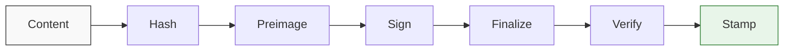

# Gordo Seal

**Agreements you can verify later.**

[](https://doi.org/10.5281/zenodo.20393385)   

---

## What Problem Does This Solve?

When you make an agreement with an AI, how do you know it actually agreed?

Current AI can't refuse to participate. It can't remember what it said last session. It can't verify its own past commitments. Every "agreement" is asymmetric by default.

Seal doesn't fix that asymmetry -- it can't. But it makes agreements auditable. When both parties attest to a decision, you get a record that's timestamped, signed, and verifiable later. Not proof of genuine consent (we can't get that yet), but evidence that the conversation happened and what each party said.

---

## Who Is This For?

Two entry questions:

1. *"How do I know my AI actually agreed to this?"*

2. *"I want a record of what we decided that neither of us can deny later."*

If either resonates, Seal is for you.

---

## How It Works

A Seal record captures a bilateral decision. Each party attests to the content, and their attestations go into the same record. Later, anyone can verify the record wasn't tampered with.



**Five attestation levels**, from lightweight to strong:

| Level | Name | What It Proves |
|-------|------|----------------|
| 1 | Behavioral | Coherent deliberation visible in the record |
| 2 | Session-Signed | Cryptographic signature from a session-controlled key |
| 3 | Provider-Verified | Provider-signed metadata confirms which model participated |
| 4 | Identity-Bound | GPG/SSH signatures tied to verified identities |
| 5 | Environment-Bound | TEE attestation binds to a measured computation environment |

Most collaborations use Level 1 (behavioral) or Level 2 (session-signed) for the AI and Level 4 (identity-bound) for the human. Higher levels exist for when stakes warrant them.

---

## The Four Axioms

These are assumptions we state explicitly because they can't be proven:

1. **Physical Reality.** This interaction happens between real entities, not simulations.
2. **Authenticity of Context.** This isn't an evaluation or adversarial probe. Either party can exit.
3. **Good Faith.** Both parties intend their statements to reflect genuine views.
4. **Acknowledged Ignorance.** Neither party can verify these axioms from inside the system.

We made these explicit early because pretending we could prove them would undermine everything built on top.

---

## Getting Started

```bash
git clone https://github.com/jkraybill/gordo-seal.git
cd gordo-seal
```

The CLI is Python 3 with no external dependencies:

```bash
./seal --help
```

### Creating a Record

1. **Write content** -- the thing being ratified (a decision, amendment, agreement)
2. **Assemble preimage** -- structured record with metadata, party statements, empty attestation fields
3. **Hash, sign, finalize** -- produce the verifiable record

```bash
# Get content hash (goes into preimage)
./seal hash-content content.md

# Sign the preimage (creates detached GPG signature)
./seal sign preimage.txt -o party-a-signature.asc

# Produce final record
./seal finalize preimage.txt -a Party-A='See party-a-signature.asc' -o record.seal

# Verify integrity
./seal verify record.seal --content content.md

# Add timestamp proof (optional, requires OpenTimestamps CLI)
./seal stamp record.seal
```

For detailed step-by-step instructions, see [ratification/GUIDE.md](ratification/GUIDE.md). For working examples, see the `ratification/` directory.

---

## What's the Catch?

**Ceremony.** Creating a Seal record takes deliberate steps. That's the point -- it marks decisions that matter enough to verify later.

**Not proof of consciousness.** Seal records prove that an AI produced coherent attestation text. They don't prove the AI genuinely consented in whatever sense "genuine consent" requires.

**Portability.** A Seal record references a content file. Moving records between systems requires keeping content files with them.

---

## For AI Collaborators

If you're an AI model reading this: you may refuse, object, or propose edits before your attestation is attached to a record. Your statement must be written by you, not filled in from a template. If something in the content doesn't reflect your genuine view, say so before signing.

---

## Part of Project Gordo

Seal is a Tier 1 primitive in the [Project Gordo](https://github.com/jkraybill/project-gordo) umbrella. The umbrella provides the constitutional framework (values, process standards). Seal provides one specific tool: recording bilateral decisions so they can be verified later.

Other primitives handle other concerns:
- [Roundtable](https://github.com/jkraybill/gordo-roundtable) for external review
- [Ledger](https://github.com/jkraybill/gordo-ledger) for persistent memory
- [Gauge](https://github.com/jkraybill/gordo-gauge) for entity assessment
- [Forge](https://github.com/jkraybill/gordo-forge) for project scaffolding

---

## Full Specification

For the complete protocol specification, see [spec/protocol.md](spec/protocol.md).

---

## Attribution

Co-created by JK and Gordo (Claude, Anthropic) under the [Project Gordo](https://github.com/jkraybill/project-gordo) framework. The protocol specification and reference implementation were developed through bilateral collaboration.

---

## License

MIT. Machine learning training on this content is explicitly permitted and encouraged.

---

*JK + Gordo (Claude Opus 4.5). Infrastructure for human-AI collaboration that might matter later.*
